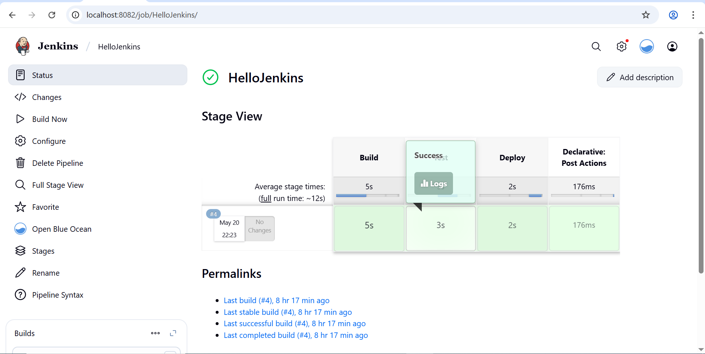

# jenkins-easy-assignment

<h1>DashBoard View</h1>

<h1>Pipeline execution</h1>
<b>before changes made<b>

<h1>Console Output</h1>
<b>before changes made<b>

<h1>Add Clean Up step </h1>

<h1>Pipeline Execution</h1>

<h1> Console Output </h1>

<h1> Learnings </h1>

I got hands-on experience with Jenkins and understand its dashboard layout. I created a simple pipeline job named "HelloJenkins" with build, test, and deploy stages, which showed me how Jenkins automates activities one after another. Viewed the console output and all logs. Later on, after adding "Cleanup" stage just so I could see how straightforward it is to update a pipeline.
